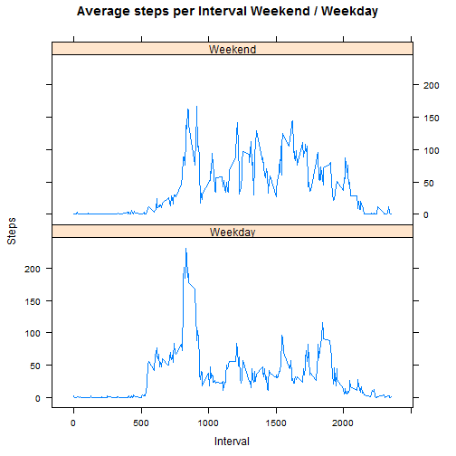

## Assignment: 

Write a report that answers the questions detailed below.  Goal is to analize data from a personal acivity monitoring device.  

## Data: 

The dataset is stored in a comma-separated-value (CSV) file and there are a total of 17,568 observations in this dataset.  The device collects data at 5 minute intervals and consists of two months of data from Oct - Nov 2012 and includes the number of steps taken  in 5 min intervals each day. 

    The variables included in this dataset are:

    - steps: Number of steps taking in a 5-minute interval (missing values are coded as   NA)

    - date: The date on which the measurement was taken in YYYY-MM-DD format

    - interval: Identifier for the 5-minute interval in which measurement was taken

## Loading and preprocessing the data


```r
library(data.table)  #will use datatable library
#read in csv file containing activity data
csv_file <- "./activity.csv"
dat <-read.csv(csv_file, header=TRUE, sep = ",", colClasses=c("numeric","Date", "integer") , na.strings = "NA")
#create datatable
dtActivity <- data.table(dat)
```
## What is mean total number of steps taken per day?

1. Calculate the total number of steps taken per day


```r
## Transform the data, aggregate steps by day
totSteps1 <- aggregate(x = dtActivity$steps, by = list(day = dtActivity$date),FUN = "sum",na.rm=FALSE)
```

2. Make a histogram of the total number of steps taken each day

```r
hist(totSteps1$x,
     col=heat.colors(8),
     xlab = "Steps taken per day", 
     ylab = "Frequency of Days",
     main = "Total Steps Taken Each day")
```

 

3. Calculate and report the mean and median total number of steps taken per day

```r
totmean <- mean (totSteps1$x,na.rm = TRUE)
totmedian <- median (totSteps1$x,na.rm = TRUE)
```

The mean number of steps per day is 1.0766189 &times; 10<sup>4</sup> and the median number of steps per day is 1.0765 &times; 10<sup>4</sup>. 

## What is the average daily activity pattern?

1. Make a time series plot (i.e. type = "l") of the 5-minute interval (x-axis) and the average number of steps taken, averaged across all days (y-axis)


```r
### group by interval, compute the mean number of steps
StepsInterval <- aggregate(x = list(steps = dtActivity$steps), by = list(interval = dtActivity$interval), FUN = "mean", na.rm=TRUE)

plot (x = StepsInterval$interval,
      y = StepsInterval$steps,
      type = "l",
      col = "blue",
      main = "Average number of Steps Taken, Averaged Across All Days", 
      xlab = "Interval",
      ylab = "Steps Taken"
      )
```

 

2. Which 5-minute interval, on average across all the days in the dataset, contains the maximum number of steps?


```r
## Calculate the interval having the most steps.
maxInterval <- StepsInterval[ StepsInterval$steps== max(StepsInterval$steps), 1]
```
The interval with the max number of steps is 835 .

## Imputing missing values

1. Calculate and report the total number of missing values in the dataset (i.e. the total number of rows with NAs)

```r
## count of the total number of missing values in the activity dataset (steps col)
numNA <- sum(is.na(dtActivity$steps))
```
The number of missing values is 2304.

2. Devise a strategy for filling in all of the missing values in the dataset. 

The strategy devised will be to replace missing values with the average for the corresponding interval. 

3. Create a new dataset that is equal to the original dataset but with the missing data filled in.


```r
##datatable to use for replacing NAs
dtActReplNA <- dtActivity

##Loop thru rows containing missing intervals and replace with mean which was 
##previously calculated in the StepsInterval dataframe
for (dfIndex in which(is.na(dtActReplNA)))  { 
  IntervalNA <- dtActReplNA[dfIndex, interval] #Get missing interval
 dtActReplNA[dfIndex, 1]  <- StepsInterval[StepsInterval$interval == IntervalNA,2]
}
```
4. Make a histogram of the total number of steps taken each day and calculate and report the mean and median total number of steps taken per day. Do these values differ from the estimates from the first part of the assignment? What is the impact of imputing missing data on the estimates of the total daily number of steps?


```r
###New calculation for total steps by date now that NAs have been replaced with
### mean for that interval
totReplNA <- aggregate(x = dtActReplNA$steps, by = list(day = dtActReplNA$date), FUN = "sum")

##Histogram of the total number of steps taken each day with missing values filled in. 
hist(totReplNA$x,
     col=heat.colors(8),
     xlab = "Steps taken per day", 
     ylab = "Frequency of Days",
     main = "Histogram - Total Number of Steps Taken Each day \n(Missing Values replaced with Corresponding Interval Means)")
```

 

```r
##mean and median total number of steps taken per day
totReplNAMean <- mean (totReplNA$x)
totReplNAMedian <- median (totReplNA$x)
```
The new calculation for mean: 1.0766189 &times; 10<sup>4</sup>  is unchanged from the previous calculation.  The median: 1.0766189 &times; 10<sup>4</sup> has increased slightly from the value above (1.0765 &times; 10<sup>4</sup>) due to the replacement of the missing values with the average number of steps per interval. 

The impact of imputing the missing data was that it increased the median but the mean was unchanged. 

## Are there differences in activity patterns between weekdays and weekends?

For this part we will use the dataset with the filled-in missing values.

1. Create a new factor variable in the dataset with two levels - "weekday" and "weekend" indicating whether a given date is a weekday or weekend day.

```r
#### Create a new factor variable for the Day Indicator (DI), initialize values to Weekday
dtActReplNAWD <- dtActReplNA
dtActReplNAWD$DI <- as.factor("Weekday")

## Loop through the dataframe and label the weekends
for (dfIndex in 1:nrow(dtActReplNAWD )) { 
     dow <- weekdays(dtActReplNAWD[dfIndex,date])
     if (dow == "Saturday" | dow == "Sunday")
          dtActReplNAWD[dfIndex,4] <- "Weekend"
}
```

2. Make a panel plot containing a time series plot (i.e. type = "l") of the 5-minute interval (x-axis) and the average number of steps taken, averaged across all weekday days or weekend days (y-axis).


```r
## group by DI (day indicator factor) and interval, get average steps
StepsIntervalNAWD <- aggregate(x = list(steps = dtActReplNAWD$steps), by = list(DI = dtActReplNAWD$DI , interval = dtActReplNAWD$interval), FUN = "mean")

## Panel plot containing a tmie series plot of the 5 minute interval and average number of steps taken, averaged across all weekdays and weekend days. 
library(lattice)
xyplot(StepsIntervalNAWD$steps ~ StepsIntervalNAWD$interval|StepsIntervalNAWD$DI,
       type="l",
       layout = c(1,2),
       xlab="Interval", 
       ylab="Steps",
       main="Average steps per Interval Weekend / Weekday")
```

 

#### end of report


